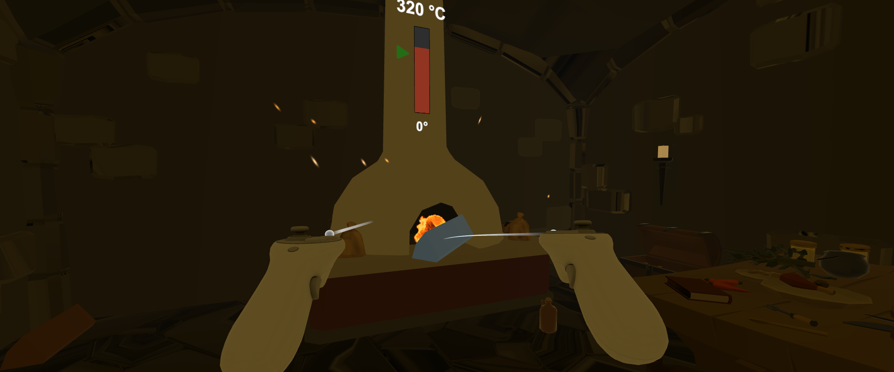
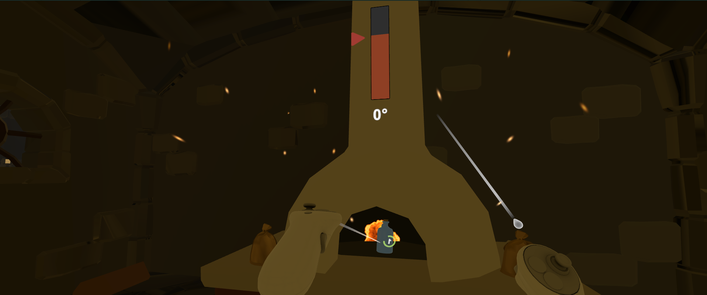
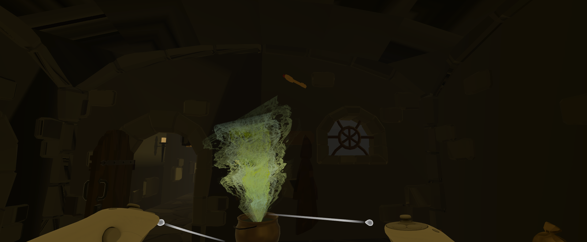
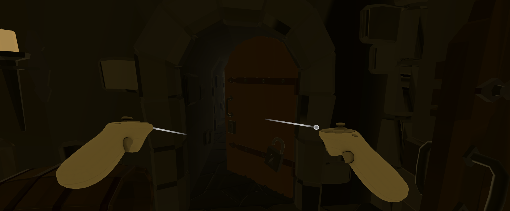
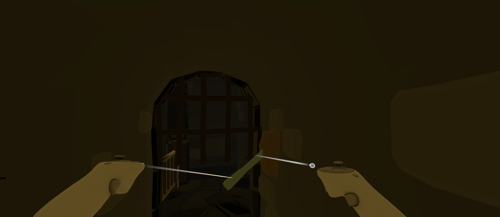
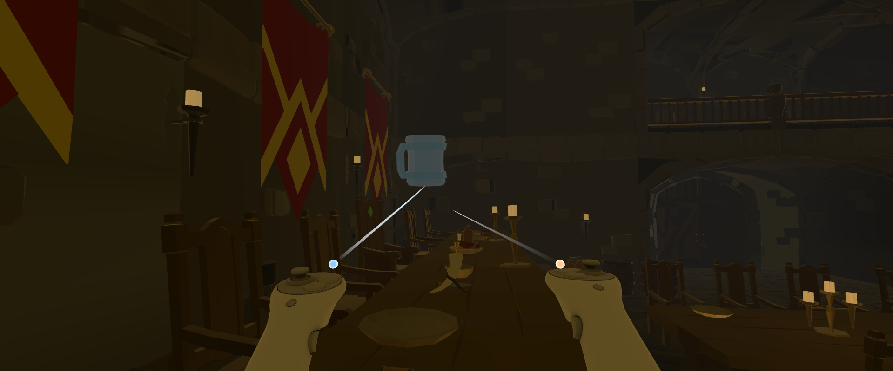
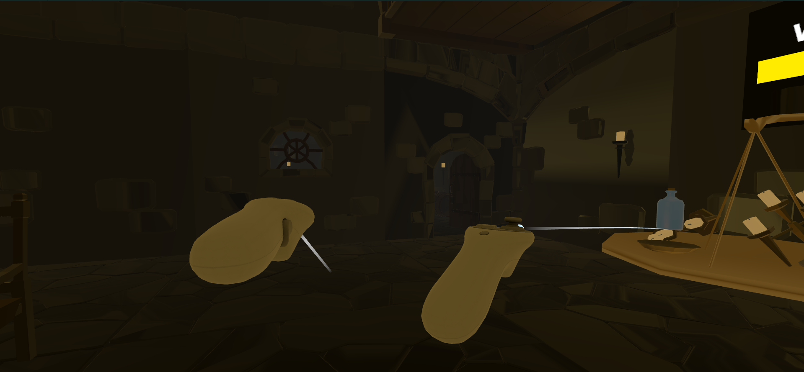
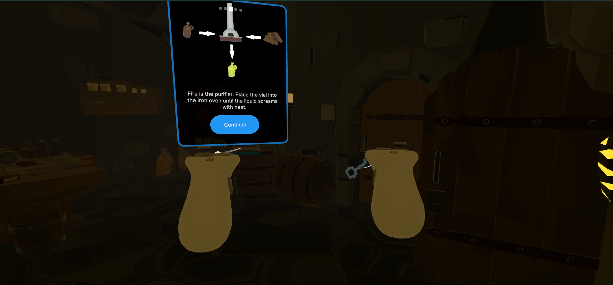

# 🏰 King’s Trials - <a href="https://github.com/xAgesx/First_VR_Game-Unity/releases/tag/v0.1">Download here

<h2>👁️ Virtual Tour</h2>

  <h3>📽️ Game Intro</h3>
  <a href="https://youtu.be/CzULPhI44yg">
    
     
    <b>Click to Watch on YouTube</b>
  </a>

 

<h3>📸 Project Gallery</h3>
<table style="width:100%; table-layout:fixed; border-collapse: collapse;">
  <tr>
    <td></td>
    <td></td>
    <td></td>
    <td></td>
  </tr>
  <tr>
    <td></td>
    <td></td>
    <td></td>
    <td></td>
  </tr>
</table>

<h2>📖 About the Game</h2>

  <b>King’s Trials</b> is a <b>First-Person VR Puzzle</b> game and my debut project in Virtual Reality development. 

  You awaken in a decaying, silent castle, guided only by the haunting voice of a fallen King. As the "Architect," you must navigate the ruins and solve environmental puzzles to uncover the secrets of the kingdom. This project was built with a focus on <b>immersion, atmosphere, and intuitive VR controls.</b>

<h2>✨ Appealing Features</h2>
<ul>
  <li><b>Narrative-Driven Puzzles:</b> The story is told through a voice-acted narrator who reacts to your progress and provides clues to the puzzles ahead.</li>
  <li><b>Physicalized Interactions:</b> Instead of clicking buttons, you physically reach out to pull mechanical levers, grab objects, and interact with the world.</li>
  <li><b>Cinematic VR Intro:</b> A custom-designed opening sequence that sets the mood with a "movie-style" camera sweep before giving the player full control.</li>
  <li><b>VR Comfort & Sprinting:</b> Features smooth movement and a dedicated <b>Sprint mechanic (X Button)</b> for fluid exploration of the large castle halls.</li>
</ul>

<h2>🛠️ Project Status: In Development</h2>

This is my <b>first VR project</b> and is currently a work-in-progress as I continue to add new levels and more complex physics puzzles.

<ul>
  <li><b>Current Version:</b> Includes the Intro, Dining Hall, Kitchen, and initial Basement segments.</li>
  <li><b>Development Focus:</b> Refining hand-tracking interactions and expanding the narrative.</li>
</ul>

<h2>🕹️ Simple Controls</h2>
<table border="1" style="border-collapse: collapse; width: 60%; background-color: #1a1a1a; color: white;">
  <tr><th style="padding:8px;">Action</th><th style="padding:8px;">Input</th></tr>
  <tr><td style="padding:8px;"><b>Movement</b></td><td style="padding:8px;">Left Thumbstick</td></tr>
  <tr><td style="padding:8px;"><b>Crouch</b></td><td style="padding:8px;">Hold X (Left Controller)</td></tr>
  <tr><td style="padding:8px;"><b>Interaction/Grab</b></td><td style="padding:8px;">Grip Buttons</td></tr>
  <tr><td style="padding:8px;"><b>Look</b></td><td style="padding:8px;">360° Head Tracking / Right Stick</td></tr>
</table>

<h2>⚙️ Technical Specs</h2>
<ul>
  <li><b>Engine:</b> Unity (Built with Unity 6 / URP)</li>
  <li><b>SDK:</b> XR Interaction Toolkit (XRI)</li>
  <li><b>Platform:</b> Meta Quest / OpenXR</li>
</ul>

 

<blockquote>
  <b>A Note from the Developer:</b> 
  This project marks my first steps into the world of VR. It showcases my ability to create a thick atmosphere, implement physics-based logic, and manage player comfort in a 3D space.
</blockquote>
